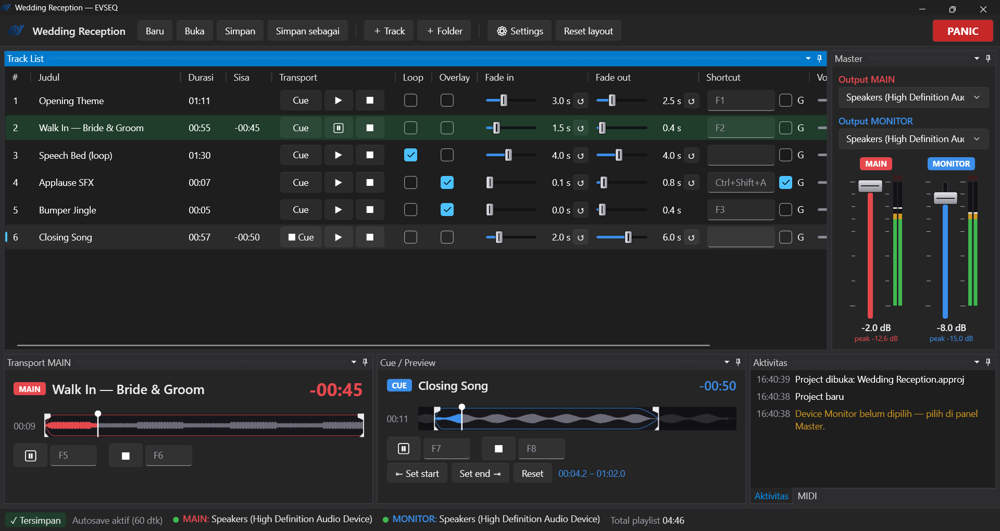
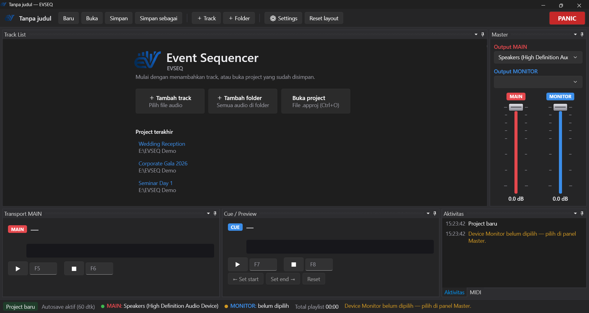
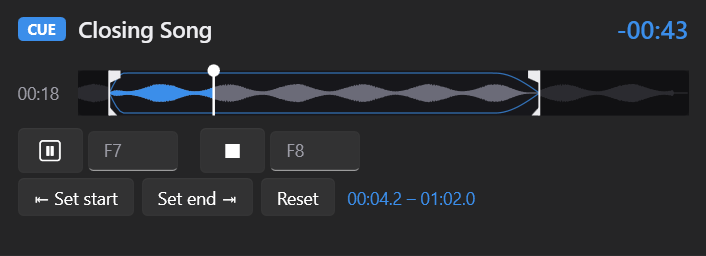
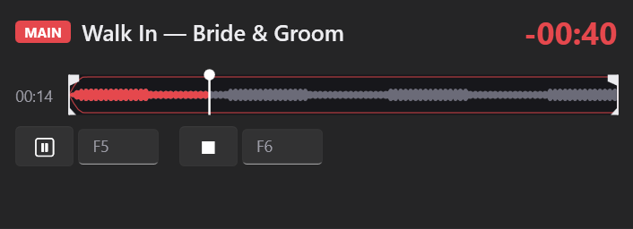
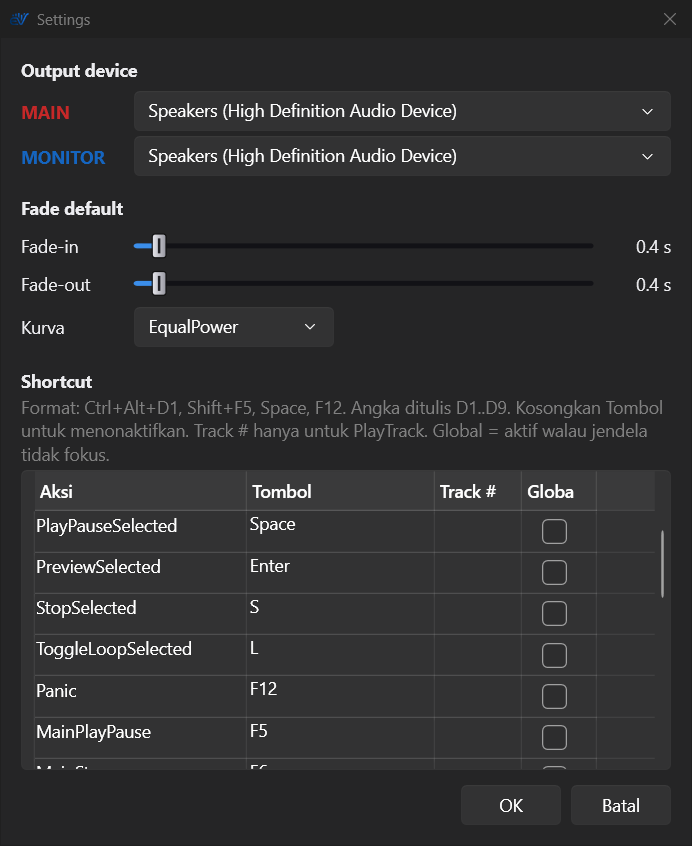
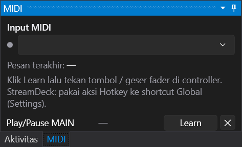

<p align="center">
  <picture>
    <!-- The full logo's navy lettering disappears on GitHub's dark theme, so dark mode shows the mark only -->
    <source media="(prefers-color-scheme: dark)" srcset="assets/brand/evseq-logo.png">
    
  </picture>
</p>

# Event Sequencer (EVSEQ)

Pemutar audio multi-track untuk operator event (wedding, seminar, gathering, siaran), native Windows.
Dua jalur output terpisah: **MAIN** untuk audiens dan **MONITOR** untuk operator mendengarkan (cue) track berikutnya tanpa bocor ke sound system.

*A native Windows multi-track audio player for live event operators, with separate Main (audience) and Monitor (cue) outputs.*



## Fitur

- **Dua output** WASAPI di device berbeda (mis. sound system + headphone), bisa diganti saat live tanpa memutus output lain.
- **Satu daftar track**: tiap track punya tombol **Cue** (ke Monitor) dan **Play** (ke Main). Track *overlay* (jingle/SFX) bisa main di atas track utama.
- **Auto fader**: fade-in/fade-out per track atau default global, kurva linear / equal-power, fade-out otomatis menjelang akhir track (end point atau akhir file).
- **Start/end point** per track, bisa di-drag langsung di seek bar.
- **Seek bar dengan waveform** yang dibentuk oleh kurva fade, penanda start/end, dan label waktu saat hover.
- **Fader** per track dan master MAIN/MONITOR bergaya mixing console, dengan **peak meter** stereo (peak hold + lampu clip) di tiap output.
- **Shortcut** lokal & global (jalan walau jendela tidak fokus), per track dan untuk transport MAIN/CUE; **PANIC** menghentikan semua seketika.
- **MIDI controller** dengan MIDI learn; **StreamDeck** lewat aksi Hotkey ke shortcut global.
- **Project** (`.approj`, JSON) dengan autosave, pemulihan setelah crash, dan daftar project terakhir.
- **Panel docking** yang bisa dipindah, ditumpuk, atau dilepas ke monitor lain; layout diingat.
- Format: WAV, MP3, AIFF, FLAC, OGG.

## Instalasi

Unduh `EVSEQ-Setup-x.y.z.exe` dari halaman **Releases**, lalu jalankan. Installer bersifat offline dan tidak membutuhkan instalasi .NET terpisah.
Installer belum ditandatangani secara digital, jadi Windows SmartScreen mungkin menampilkan peringatan ("More info" → "Run anyway").

Kebutuhan: Windows 10 atau 11, 64-bit.

## Workflow

### 1. Mulai: buat atau buka project



Saat daftar track masih kosong, EVSEQ menampilkan welcome screen:

- **＋ Tambah track** — pilih satu atau beberapa file audio.
- **＋ Tambah folder** — semua audio di folder (termasuk subfolder) masuk berurutan sesuai nama file.
- **Buka project** (`Ctrl+O`) atau klik salah satu **Project terakhir**.

Project juga bisa dibuka langsung dari command line: `EVSEQ.exe "D:\Show\Wedding.approj"`.

### 2. Atur output: MAIN untuk audiens, MONITOR untuk operator

Di panel **Master** (kanan):

- **Output MAIN** — device yang terhubung ke sound system.
- **Output MONITOR** — headphone/speaker operator untuk cue.
- Dua fader master untuk volume keseluruhan tiap jalur.
- **Peak meter** L/R di samping tiap fader, mengukur level yang benar-benar keluar ke device (setelah master fader): hijau, kuning di atas −18 dB, merah di atas −6 dB. Garis putih menahan puncak terakhir; angka *peak* di bawahnya menunjukkan nilainya dalam dBFS.
- **Lampu CLIP** di atas meter menyala merah bila sinyal menyentuh 0 dBFS dan tetap menyala sampai diklik — tanda untuk menurunkan volume. Kejadiannya juga tercatat di panel Aktivitas.

Mengganti satu output tidak memutus output yang lain, jadi aman dilakukan saat live. Monitor sengaja **tidak pernah** berpindah otomatis ke device default, supaya preview tidak bocor ke audiens. Bila sebuah device dicabut saat berjalan, muncul banner merah dan catatan di panel **Aktivitas**.

### 3. Siapkan setiap track

Di **Track List**, setiap baris bisa diatur:

| Kolom | Fungsi |
|---|---|
| **Cue / ▶ / ■** | Cue ke Monitor, Play/Pause ke Main, Stop Main |
| **Loop** | Ulang terus (mis. musik latar sambutan) |
| **Overlay** | Main di atas track lain tanpa menghentikannya (jingle, applause, SFX) |
| **Fade in / Fade out** | Durasi fade per track (0–10 detik). Label abu-abu miring = memakai default dari Settings; **↺** kembali ke default |
| **Shortcut** | Klik kotaknya lalu tekan tombol (mis. `F1`) untuk memutar track ini ke Main. Centang **G** agar tetap jalan walau jendela lain yang aktif |
| **Volume** | Volume per track dalam dB |

Klik kanan pada daftar untuk **Naik / Turun / Hapus dari list**.

### 4. Cue di Monitor, tentukan start & end



Panel **Cue / Preview** menampilkan track yang sedang di-cue (atau track yang dipilih di list):

- **Waveform** di seek bar sudah dibentuk oleh kurva fade — yang terlihat adalah yang akan terdengar.
- **Start / end point**: drag penanda putih di tepi rentang, atau posisikan playhead lalu klik **⇤ Set start** / **Set end ⇥**. **Reset** kembali ke seluruh file. Area di luar rentang diredupkan.
- Track selalu fade-out sendiri menjelang akhirnya — di end point bila diset, atau di akhir file — sehingga tidak pernah terpotong mendadak (kecuali track Loop, yang terus berulang).
- Arahkan mouse ke seek bar untuk melihat waktu persis di posisi itu; klik atau drag untuk berpindah posisi.
- **▶ Cue** (`F7`) mulai preview dari posisi kursor; **■** (`F8`) menghentikannya.

### 5. Play ke Main



- Tekan **▶** di baris track (atau `Space` untuk track yang dipilih, atau shortcut track-nya). Track berjalan dengan fade-in; baris berubah hijau.
- Memutar track biasa lain akan menggantikan track yang sedang main (fade-out dan fade-in bersamaan). Track **Overlay** main di atasnya.
- Panel **Transport MAIN** menunjukkan judul, sisa waktu besar, dan seek bar. **▶/⏸** (`F5`) dan **■** (`F6`) mengendalikan track di Main.
- Pause dan Stop selalu memakai fade-out, tanpa klik.
- **PANIC** (`F12`, tombol merah di kanan atas) menghentikan Main dan Monitor seketika.

### 6. Operasi tanpa mouse

| Tombol | Aksi |
|---|---|
| `↑` / `↓` | Pilih track |
| `Enter` | Cue track terpilih di Monitor |
| `Space` | Play/Pause track terpilih di Main |
| `S` | Stop track terpilih |
| `L` | Loop on/off |
| `F5` / `F6` | Play-Pause / Stop MAIN |
| `F7` / `F8` | Play-Pause / Stop CUE |
| `F12` | PANIC |
| `Ctrl+Alt+1` … `9` | Putar track nomor 1–9 (global) |

Semua shortcut bisa diubah di **Settings**, termasuk menjadikannya global.



### 7. MIDI controller & StreamDeck



Di panel **MIDI** (tab di sebelah Aktivitas): pilih input controller, lalu klik **Learn** pada sebuah fungsi dan tekan tombol / geser fader di controller. Bisa di-assign: transport MAIN/CUE, PANIC, transport & volume track terpilih, navigasi list, fader master, dan play track 1–8.
**StreamDeck**: gunakan aksi **Hotkey** bawaan StreamDeck yang mengirim shortcut global EVSEQ.

### 8. Simpan & pengaman

- `Ctrl+S` menyimpan project (file `.approj`); path audio disimpan relatif, jadi folder show bisa dipindah ke komputer lain.
- Status bar menunjukkan **✓ Tersimpan** / **● Belum disimpan**, waktu **autosave** terakhir (tiap 60 detik), dan kondisi device MAIN/MONITOR.
- Bila aplikasi tertutup tidak wajar, EVSEQ menawarkan pemulihan perubahan terakhir saat dibuka lagi.
- Panel **Aktivitas** mencatat semua kejadian: simpan, autosave, device, error.

### 9. Susun tampilan sesuai kebutuhan

Setiap panel (Track List, Master, Transport MAIN, Cue / Preview, Aktivitas, MIDI) bisa di-drag lewat judulnya: dipindah ke sisi lain, ditumpuk menjadi tab, di-resize, atau dilepas ke jendela sendiri (misalnya di monitor kedua). Susunan diingat otomatis; **Reset layout** mengembalikan ke default.

### 10. Update ke versi baru

- **Otomatis dari aplikasi** (mulai v0.3.0): saat dibuka, EVSEQ memeriksa GitHub. Bila ada versi baru, installer-nya diunduh di latar belakang dan diverifikasi dengan SHA-256, lalu muncul pemberitahuan *"siap dipasang"*. Update dipasang **saat EVSEQ ditutup** — atau klik **Pasang sekarang** (EVSEQ menutup, memasang, lalu terbuka lagi). Pemutaran yang sedang berjalan tidak pernah diganggu, dan tanpa internet EVSEQ tetap berjalan seperti biasa.
- **Manual**: unduh installer terbaru dari **Releases** dan jalankan. Installer mengenali versi yang terpasang dan langsung menjalankan **update** (bukan instalasi baru): halaman lisensi/folder/ikon dilewati, folder dan pilihan sebelumnya dipakai lagi, dan versi yang lebih lama tidak bisa menimpa yang lebih baru.
- Project, daftar project terakhir, layout panel, dan pengaturan **tidak berubah** saat update.
- Pemeriksaan otomatis bisa dimatikan di **Settings → Update**; di sana juga ada **Cek update sekarang** dan versi yang terpasang (juga terlihat di status bar).

## Build dari source

Butuh [.NET SDK 10](https://dotnet.microsoft.com/download).

```powershell
dotnet test                                   # unit test engine audio
dotnet run --project src/AudioPlayer.App      # jalankan aplikasi
.\installer\build.ps1                         # test + publish + installer (butuh Inno Setup 6)
```

Struktur:

- `src/AudioPlayer.Core` — engine audio (NAudio), model project, MIDI; tanpa UI, bisa dites tanpa soundcard.
- `src/AudioPlayer.App` — aplikasi WPF.
- `tests/AudioPlayer.Core.Tests` — unit test.
- `installer/` — skrip Inno Setup.
- `assets/brand/` — logo dan ikon.

## Lisensi

[MIT](LICENSE) © 2026 Imagaa. Komponen pihak ketiga dan lisensinya tercantum di [THIRD-PARTY-NOTICES.md](THIRD-PARTY-NOTICES.md).
